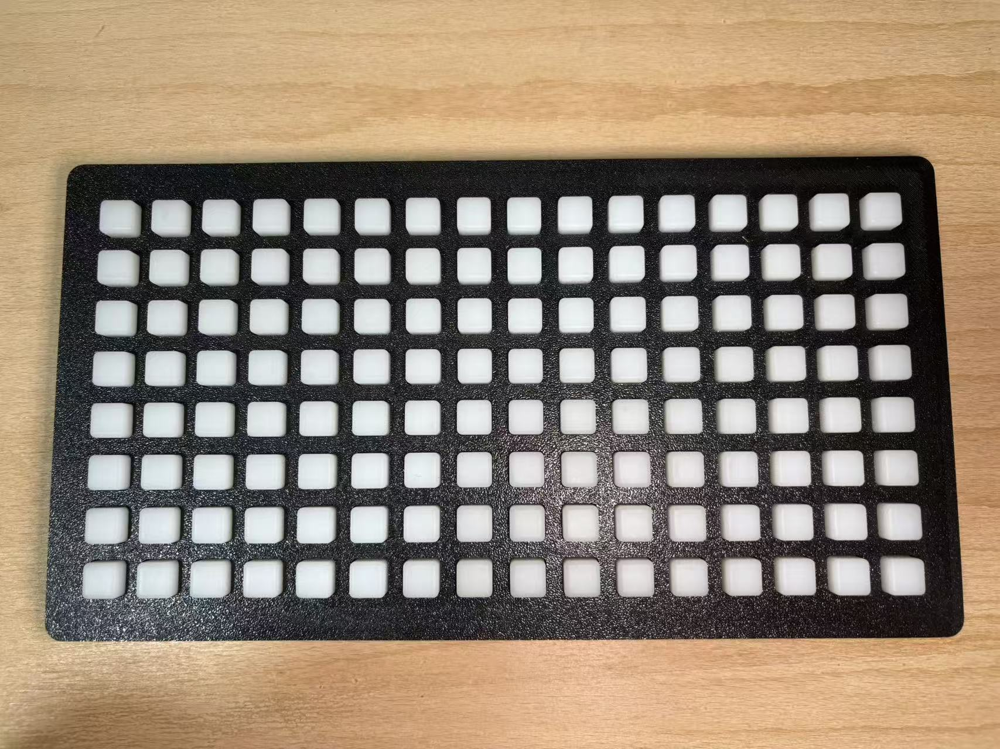
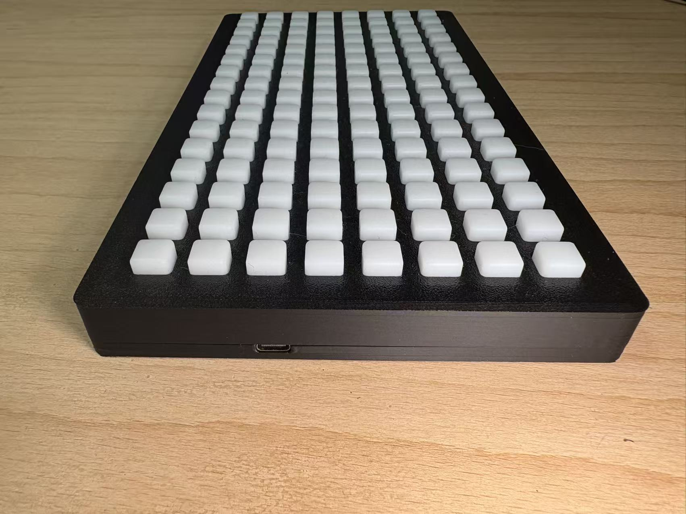
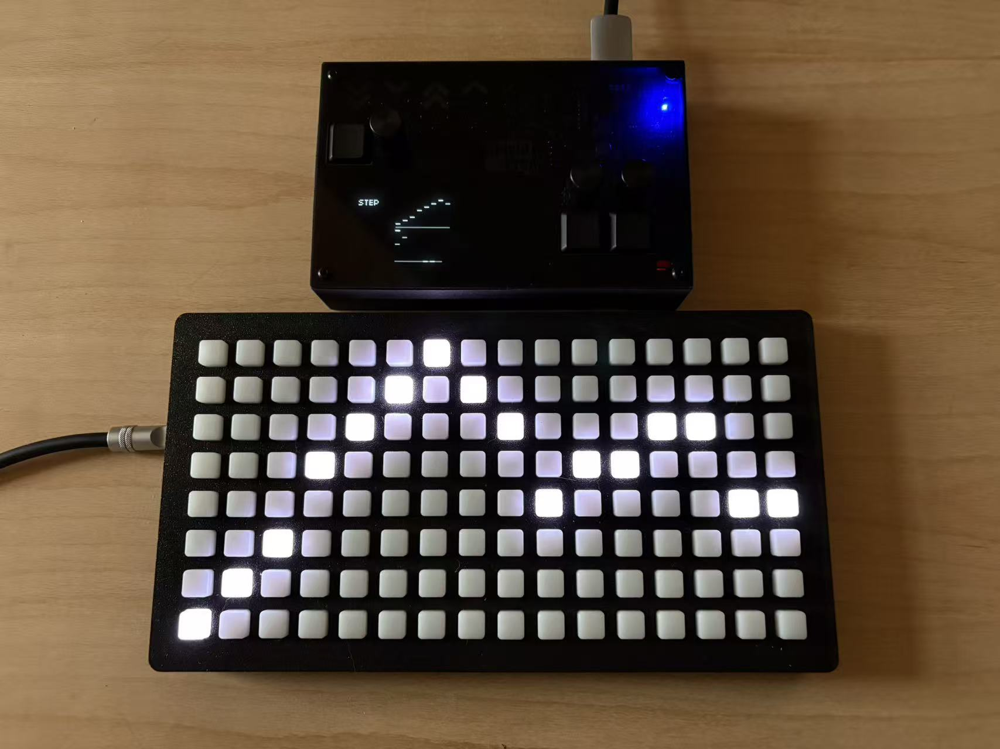
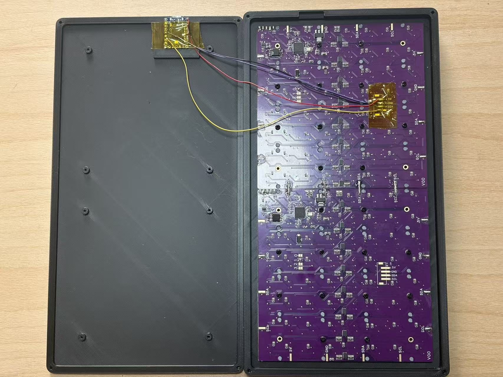

# Open Grid Controller

Open Grid Controller is an open-source 8x16 grid controller for music production, live performance, sound experiments, and interactive installations. It uses an RP2040-Zero as the main controller, appears over USB as a monome grid-compatible device, and bridges 128 key inputs plus per-key LED brightness control to two 8x8 I2C keypad/LED boards.

The project includes ready-to-build PlatformIO firmware, STEP files for the 3D-printed enclosure, and reference photos for assembly. You can use it as a complete DIY controller, or adapt it into your own sequencer, visual controller, media installation input panel, or monome-compatible hardware project.



## Features

- 8x16 matrix layout with 128 independently readable keys.
- Per-key LED brightness control with 16 levels, from 0 to 15.
- USB serial protocol compatible with the core monome grid input and LED control workflow.
- Based on RP2040-Zero, Arduino Core, and Adafruit TinyUSB.
- Two 8x8 [FREEPOET-Keypad](https://github.com/FREEPOET-OFFICIAL/FREEPOET_Keypad) I2C boards combine into a full 16-column grid.
- Supports key debouncing, hot-plug detection, full LED sync, and incremental LED refresh.
- Includes 3D-printable enclosure files for replication and customization.

## Product Photos

The front panel uses a classic 16-column, 8-row grid layout, suitable for step sequencing, clip launching, parameter mapping, and mode switching.



The enclosure has a low-profile desktop form factor with a side USB port, making it comfortable to keep beside a synthesizer, controller, or computer.



Open Grid can be used alongside other hardware controllers. The photo above shows it working with Shield Pro on the same desktop, forming a more complete live performance control setup.

## Hardware



## Bill of Materials

FREEPOET OpenGrid kit: https://github.com/FREEPOET-OFFICIAL/FREEPOET_Keypad

- RP2040-Zero main controller board.
- Two 8x8 FREEPOET_Keypad key/LED boards.
- Eight 4x4 silicone pads.

Parts to prepare separately:

- 3D-printed top cover and bottom shell.
- 4 wires.
- 24pcs M2*6 mm self-tapping screws.
- 8pcs M2*10 mm self-tapping screws.
- 6pcs M3*8 mm self-tapping screws.

The firmware uses Pico I2C0 by default:

- SDA: GPIO 4
- SCL: GPIO 5
- I2C speed: 100 kHz

Select the address jumpers as shown by the red circles in the image below:

- Board 1: solder the address bit 0 jumper.
- Board 2: solder the address bit 1 jumper.


## Repository Structure

```text
.
├── enclosure/              # 3D enclosure STEP files
│   ├── OpenGrid-Bot.step
│   └── OpenGrid-Top.step
├── pics/                   # README and assembly reference images
└── sw/                     # PlatformIO firmware project
    ├── platformio.ini
    └── src/
```

## Firmware Build and Upload

The firmware is built with PlatformIO. The target board is Raspberry Pi Pico.

1. Install VS Code and the PlatformIO extension.
2. Open the `sw` directory in this repository.
3. Connect the RP2040-Zero.
4. Build and upload the firmware:

```bash
cd sw
pio run -t upload
```

## Software Compatibility

On the USB side, Open Grid uses a monome-style serial device descriptor and reports `OpenGrid` as the device ID. The firmware implements common commands such as grid size query, device ID handling, key event reporting, and single-pixel, region, and full-grid LED control. It is intended to work with music software, scripts, or custom toolchains that support monome grid devices.

The current firmware focuses on providing a stable 8x16 grid interaction layer. If your software depends on more complete monome protocol behavior, test it against your target application and extend `sw/src/MonomeSerialDevice.cpp` as needed.

## Enclosure and Assembly

The enclosure STEP files are in `enclosure/`:

- `OpenGrid-Top.step`: top cover.
- `OpenGrid-Bot.step`: bottom shell.

## Use Cases

- Sequencer and rhythm programming controller.
- Grid input panel for Max/MSP, norns, SuperCollider, Pure Data, and similar creative environments.
- Lighting, visual, and media installation control surface.
- monome protocol learning and open-source hardware experimentation.
- Hardware foundation for custom MIDI, OSC, or USB controllers.
